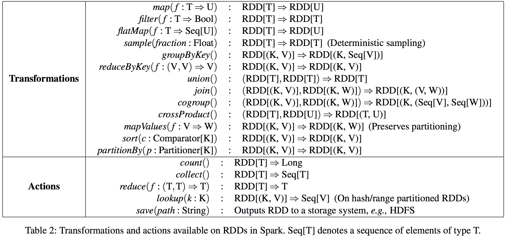
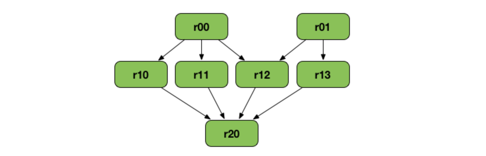

# 7574-spark

Apache Spark es un framework (open-source) de computo distribuido, que nos permite realizar una gran variedad de tareas (ETLs, machine learning, procesamiento de grafos, etc...) sobre grandes volumenes de datos a través de diferentes apis de alto nivel, para distintos lenguajes de programación como Scala, python, java, R y SQL.

En contraste con Hadoop (basado en acceso a disco, two-stages mapReduce), Spark es un framework pensado para procesamiento in-memory con multiples etapas, haciendolo ideal para algoritmos iterativos (muchos algoritmos de machine learning son iterativos: algoritmos de grafos, PageRank, K-means clustering, logistic regression por nombrar algunos).

La principal abstracción que nos provee Spark para lograr esto es RDD ([Resilient Distributed Dataset](https://jaceklaskowski.gitbooks.io/mastering-apache-spark/spark-rdd.html)), que nos permite diseñar algoritmos que serán ejecutados en un cluster de manera tolerante a fallas. 


## RDD

Los RDD son una estructura de datos paralela, tolerante a fallas que nos permiten persistir los resultados intermedios en memoria, en lugar de guardarlos en disco.
El principal desafío es lograr, de manera eficiente, la tolerancia a fallas, evitando mecanismos pre-existentes, como una memoria compartida que necesitan actualizaciones constantes de su estado (fine-grained).

Para esto se optó por una memoria compartida con restricciones (coarse-grained), basada en transformaciones (map, filter and join), 
que nos permite alcanzar la tolerancia a fallas de manera eficiente. 
Solamente se loggean las transformaciones realizadas para armar un dataset (su `linaje`) en lugar de cada cambio en la información. 
Si una partición del RDD se pierde se tiene la información necesaria para regenerar esa partición.

Esto restringe a los RDD a aplicaciones tipo batch que realizan la misma operación en todos los elementos, en pos de una tolerancia a fallas más eficiente (se evita el overhead de los checkpoints, ya que puede ser calculado a partir de su linaje).
Es decir, RDD no sería recomendable para aplicaciones que hacen operaciones asyncronicas que actualizan un estado compartido.

### Operaciones

Los tipos de operaciones que pueden realizarse sobre los RDD son solamente `transforaciones` y `acciones`. Las transformaciones son `lazy` y definen un nuevo RDD, mientras que las acciones disparan el computo de un valor.



### Linaje

El linaje (o grafo de dependencias) es un grafo con todos los padres de un RDD. Se genera a partir de una serie de transformaciones-acciones, y se utiliza para generar el plan de ejecución.
Supongamos que tenemos el siguiente grafo



Este arbol puede derivarse de la siguiente secuencia de comandos:

```scala
val r00 = sc.parallelize(0 to 9)
val r01 = sc.parallelize(0 to 90 by 10)
val r10 = r00 cartesian r01
val r11 = r00.map(n => (n, n))
val r12 = r00 zip r01
val r13 = r01.keyBy(_ / 20)
val r20 = Seq(r11, r12, r13).foldLeft(r10)(_ union _)
```

